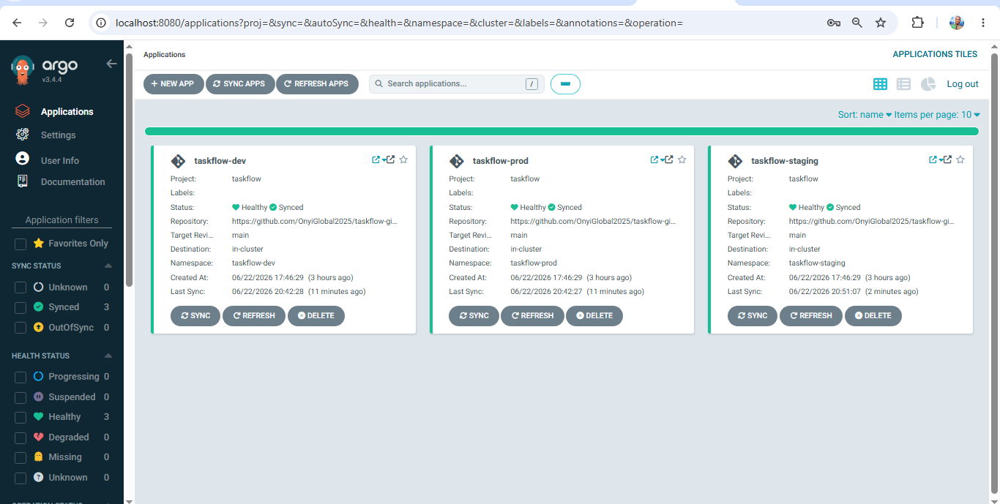
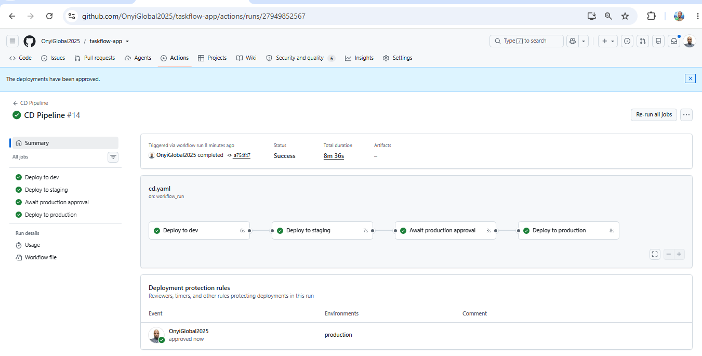
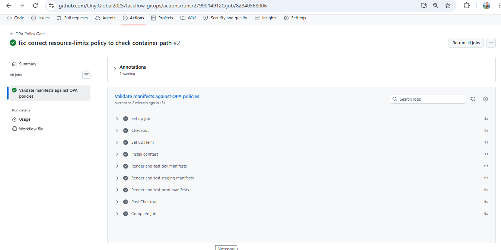
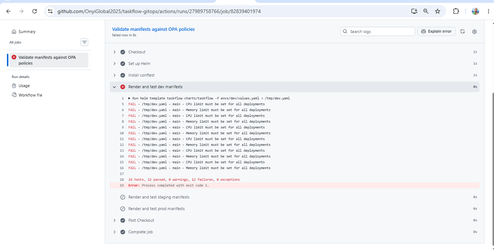
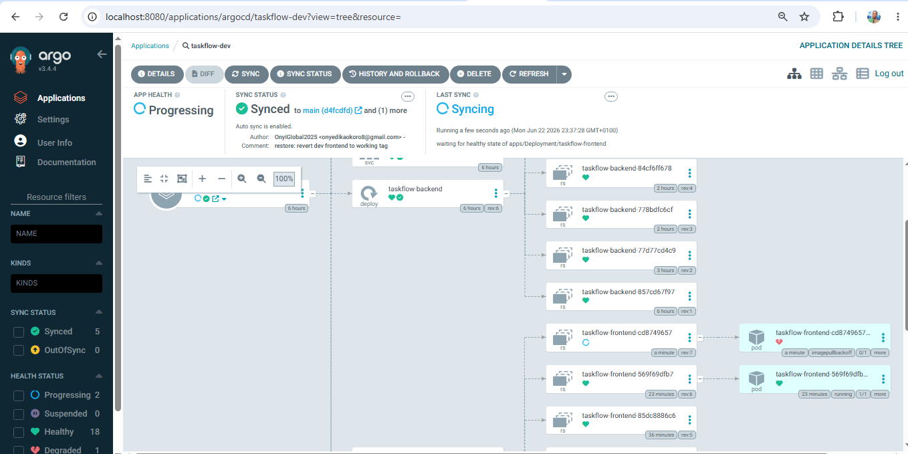

# TaskFlow — Multi-Environment CI/CD Platform with Promotion Gates


A production-style GitOps delivery platform that extends the TaskFlow application to deploy across **dev → staging → prod** on AWS EKS, with environment-specific configuration, manual approval gates, automated rollback on failed health checks, policy-as-code enforcement, and per-stage Slack notifications.

This project focuses on the **software delivery lifecycle** — the part of platform engineering most teams care about day to day: promoting a build safely through environments, catching bad changes before they reach production, and recovering automatically when something goes wrong.

---

## Table of contents

- [What this project demonstrates](#what-this-project-demonstrates)
- [Architecture](#architecture)
- [Repository layout](#repository-layout)
- [The delivery pipeline](#the-delivery-pipeline)
- [Feature breakdown](#feature-breakdown)
- [Key resource identifiers](#key-resource-identifiers)
- [Operational runbook](#operational-runbook)
- [Troubleshooting log](#troubleshooting-log)
- [Known issues and future work](#known-issues-and-future-work)
- [Conventions](#conventions)

---

## What this project demonstrates

This platform builds directly on the Foundation TaskFlow project (Terraform · Helm · AWS Load Balancer Controller · OIDC/IRSA · Trivy · Prometheus/Grafana · ACM · Route 53 · ExternalDNS · ArgoCD) and extends it into a full multi-environment delivery pipeline.

Capabilities delivered:

- **Three isolated environments** — dev, staging, and prod, each in its own namespace with its own configuration, rendered from a single Helm chart.
- **GitOps reconciliation** — ArgoCD ApplicationSet generates one application per environment; the cluster state is driven entirely from Git.
- **Promotion pipeline** — a build flows automatically dev → staging, then pauses for **manual approval** before production.
- **Automated rollback** — after each promotion, the pipeline verifies rollout health and reverts the change if the deployment is unhealthy.
- **Policy-as-code gates** — OPA/conftest policies validate every rendered manifest before it can reach the cluster.
- **Security scanning** — SAST (Semgrep) and container image scanning (Trivy) in CI.
- **Observability of delivery** — per-stage Slack notifications for deploys, approval requests, and rollbacks.

---

## Architecture



The platform spans two repositories and a GitOps control loop:

```
  Developer push
        │
        ▼
┌─────────────────┐     builds & scans      ┌──────────────┐
│   taskflow-app  │ ──────────────────────► │     ECR      │
│  (CI Pipeline)  │   backend-<sha>          │  (images)    │
│                 │   frontend-<sha>         └──────────────┘
└────────┬────────┘
         │ triggers
         ▼
┌─────────────────┐     updates image tags   ┌──────────────────┐
│   taskflow-app  │ ──────────────────────►  │  taskflow-gitops │
│  (CD Pipeline)  │   per environment         │  (Helm values)   │
│                 │                           └────────┬─────────┘
│ dev → staging   │                                    │ watched by
│   → approval    │                                    ▼
│   → prod        │                           ┌──────────────────┐
└─────────────────┘                           │     ArgoCD       │
                                              │  ApplicationSet  │
                                              └────────┬─────────┘
                                                       │ syncs
                          ┌────────────────────────────┼────────────────────────────┐
                          ▼                             ▼                             ▼
                  ┌──────────────┐            ┌──────────────┐              ┌──────────────┐
                  │ taskflow-dev │            │taskflow-stage│              │taskflow-prod │
                  │  namespace   │            │  namespace   │              │  namespace   │
                  └──────────────┘            └──────────────┘              └──────────────┘
                                   AWS EKS cluster (taskflow-eks-cluster)
                          ALB · ACM (wildcard TLS) · Route 53 · ExternalDNS
```

The application is split into a **backend** (Node.js API on port 5000) and a **frontend** (nginx serving a built Vite SPA on port 80), each with its own image and its own image tag per environment.

---

## Repository layout

**taskflow-app** — application source and pipelines

```
taskflow-app/
├── backend/                     # Node.js API
├── frontend/                    # Vite SPA served by nginx
│   ├── Dockerfile
│   └── nginx.conf               # nginx server config (serves SPA on :80)
└── .github/workflows/
    ├── ci.yaml                  # build, test, SAST, container scan, push
    └── cd.yaml                  # promote dev → staging → prod, rollback, Slack
```

**taskflow-gitops** — Helm chart, environment values, GitOps definitions, policies

```
taskflow-gitops/
├── charts/taskflow/
│   ├── templates/
│   │   ├── deployment.yaml      # backend + frontend deployments
│   │   ├── service.yaml
│   │   ├── ingress.yaml         # ALB ingress, ACM TLS
│   │   └── hpa.yaml
│   ├── Chart.yaml
│   └── values.yaml              # chart base values
├── envs/
│   ├── dev/values.yaml          # per-environment overrides
│   ├── staging/values.yaml
│   └── prod/values.yaml
├── argocd/
│   ├── applicationset.yaml      # generates one app per environment
│   └── project.yaml             # AppProject with namespace/source restrictions
├── policies/opa/                # policy-as-code (conftest)
│   ├── resource-limits.rego
│   ├── no-latest-tag.rego
│   └── prod-replicas.rego
└── .github/workflows/
    └── opa-policy-check.yaml     # renders chart, runs conftest gate
```

---

## The delivery pipeline

### CI (taskflow-app `ci.yaml`)

Triggered on push. Stages:

1. **Lint and unit tests** — Node.js dependency install and test run.
2. **SAST scan** — Semgrep with `p/nodejs` and `p/secrets` rulesets.
3. **Build and push** — builds backend and frontend images, scans each with Trivy (CRITICAL/HIGH), pushes both `<component>-<sha>` and `<component>-latest` tags to ECR. Authentication to AWS is via GitHub OIDC (no long-lived keys).

### CD (taskflow-app `cd.yaml`)



Triggered when CI completes successfully. Flow:

```
promote-dev → (health check + rollback) → promote-staging → approve-prod → promote-prod
```

1. **Deploy to dev** — updates dev image tags in the gitops repo, then authenticates to the cluster, waits for ArgoCD to sync, and runs `kubectl rollout status` on both deployments. If either is unhealthy, it reverts the promotion commit (ArgoCD rolls back to the last good image), alerts Slack, and fails the job — which halts promotion to staging and prod.
2. **Deploy to staging** — promotes the same build to staging, posts a Slack notification.
3. **Await production approval** — gated by a GitHub Environment (`production`) with required reviewers; posts a Slack "approval needed" message with a link.
4. **Deploy to production** — promotes to prod after approval, posts a Slack confirmation.


### Policy gate (taskflow-gitops `opa-policy-check.yaml`)

Triggered on push/PR. Renders the Helm chart for each environment and runs conftest against the OPA policies. A policy violation fails the workflow, blocking non-compliant manifests from reaching the cluster.

---


## Feature breakdown

| Feature | Status | Notes |
|---|---|---|
| Environment-specific Helm values | ✅ Done | Separate `values.yaml` per env; single chart rendered three ways |
| Multi-environment deploy (dev → staging → prod) | ✅ Done | ArgoCD ApplicationSet, all three Synced and Healthy |
| GitHub Actions CI/CD | ✅ Done | CI builds/scans/pushes; CD promotes through environments |
| Manual approval gate | ✅ Done | GitHub Environment `production` with required reviewers |
| Automated rollback on failed health check | ✅ Done | Health check + `git revert`; healthy path proven, failure detection demonstrated |
| Slack notifications per stage | ✅ Done | Deploy, approval-needed, and rollback alerts |
| SAST (Semgrep) | ✅ Integrated | Runs in CI (non-blocking baseline) |
| Container scanning (Trivy) | ✅ Integrated | Both images scanned, SARIF uploaded with unique categories |
| OPA policy gates | ✅ Done | Enforced via conftest; validates all three environments |
| DAST (OWASP ZAP) | 🔶 Deferred | `.zap` config present; pipeline integration pending a healthy dev target |

### Policy-as-code detail





Three policies enforce real production standards on every rendered manifest:

- **resource-limits** — every container must declare CPU and memory limits.
- **no-latest-tag** — no image may use the bare `:latest` tag; versions must be pinned (Git SHA).
- **prod-replicas** — production deployments must run at least 3 replicas.

The `prod-replicas` policy drove a real improvement: production was running a single replica and was raised to 3 to satisfy the gate, improving availability.

---

## Key resource identifiers

| Resource | Value |
|---|---|
| AWS account | `713923090919` |
| Region | `us-east-1` |
| EKS cluster | `taskflow-eks-cluster` |
| ECR repository | `taskflow` (single repo, component-prefixed tags) |
| Hosted zone | `Z05244921MYU2GBYDYLPA` (`okorojeremiah.online`) |
| ACM certificate | wildcard `*.okorojeremiah.online` (+ apex) |
| GitHub Actions role | `taskflow-github-actions-role` |
| ALB controller IRSA role | `alb-controller-irsa-role` |
| ExternalDNS IRSA role | `external-dns-irsa-role` |

Environment hosts:

- prod — `taskflow.okorojeremiah.online`
- staging — `staging-taskflow.okorojeremiah.online`
- dev — `dev-taskflow.okorojeremiah.online`

> **Note on hostnames:** environments use single-level subdomains (`dev-taskflow`, not `dev.taskflow`) so the single-label wildcard certificate `*.okorojeremiah.online` covers them. A `dev.taskflow.okorojeremiah.online` host would be two labels deep and would **not** be matched by the wildcard.

---

## Operational runbook

This environment is torn down between sessions to control cost; all state lives in Git and remote Terraform state. Bring-up order on a fresh cluster:

1. Provision infrastructure with Terraform (EKS, VPC, IAM, ECR).
2. Install **ArgoCD**.
3. Install the **AWS Load Balancer Controller** (Helm), using the correct cluster name `taskflow-eks-cluster`.
4. Install **ExternalDNS** with its IRSA role.
5. Apply the ArgoCD `AppProject` and `ApplicationSet`.
6. Confirm images exist in ECR (rebuild via CI if the repo was destroyed on teardown).

Useful checks:

```bash
# environment health
kubectl get pods -n taskflow-dev
kubectl get ingress -n taskflow-dev

# clear a wedged ArgoCD sync operation
kubectl patch application taskflow-dev -n argocd --type merge -p '{"operation": null}'

# verify live ingress host
kubectl get ingress taskflow-ingress -n taskflow-dev -o jsonpath='{.spec.rules[0].host}'
```

---

## Troubleshooting log

A record of issues encountered during a full rebuild and how they were resolved. These are documented because they represent the real, non-obvious failure modes of this stack.

**ArgoCD "Unknown" sync / ComparisonError.** A YAML syntax error (a tab character on a blank line) in an env `values.yaml` prevented `helm template` from rendering, so ArgoCD could not compute a diff. Resolved by converting indentation to spaces. Lesson: ArgoCD renders from committed Git state, not the working copy — uncommitted fixes have no effect.

**ImagePullBackOff — image string errors.** Several distinct causes were untangled: a slash instead of a colon in the image template (`repo/backend-latest` vs `repo:backend-latest`); a doubled tag prefix (`tag: backend-latest` combined with a template that prepends `backend-`); and a structural mismatch between the deployment template and the per-component `backend.image` / `frontend.image` values. Resolved by aligning the template and all env values to a consistent per-component structure.

**ALB controller install failure.** `helm install` failed with "No cluster found for name: taskflow-cluster" — the wrong cluster name. Corrected to `taskflow-eks-cluster`.

**ALB controller ACM permission.** The controller's IRSA role lacked `acm:ListCertificates`, so it could not validate the ingress certificate and never provisioned the ALB. Added the ACM actions to the role (live, then permanently in `iam-alb-policy.json`).

**Wildcard certificate vs hostname depth.** `*.okorojeremiah.online` matches `taskflow.okorojeremiah.online` but **not** `dev.taskflow.okorojeremiah.online` (two labels deep). Resolved by switching dev/staging to single-level hosts (`dev-taskflow`, `staging-taskflow`).

**Wedged ArgoCD sync.** A sync operation stuck "in progress" silently swallowed every subsequent sync, so host changes never applied. Cleared with `kubectl patch application ... -p '{"operation": null}'`, then deleted the stale ingress so ArgoCD recreated it from Git.

**ExternalDNS — no IRSA role.** ExternalDNS failed with "no EC2 IMDS role found" because its service account had no IAM role. Created a Route 53 policy and IRSA role, annotated the service account, and restarted — records then created successfully.

**502 Bad Gateway — empty nginx config.** The frontend `nginx.conf` was empty, so the image's nginx had no `server`/`listen` directive and refused connections on port 80; the ALB marked the target unhealthy. Compounded by a CD promotion bug (below). Resolved by adding a proper nginx server block and rebuilding the image.

**CD promotion bug (root cause of the 502 saga).** The CD `sed` matched every `tag:` line and hardcoded a `backend-` prefix, so it overwrote the **frontend** tag with a **backend** image — the frontend pod was running the backend. Fixed by matching backend and frontend tag lines independently and promoting each component's own image.

**aws-auth + IAM for pipeline rollback.** Enabling the CD health check required two separate authorizations: mapping `taskflow-github-actions-role` into the cluster's `aws-auth` configmap (Kubernetes API access), and granting `eks:DescribeCluster` on the IAM role (for `aws eks update-kubeconfig`). Both were added.




> **Permanence note:** several fixes were applied live (IAM inline policies, `aws-auth` mapping). Because this environment is torn down and re-applied, these must also live in Terraform so they survive teardown. The ALB ACM permission is already captured in `iam-alb-policy.json`; the ExternalDNS role, the CD role's `aws-auth` mapping, and `eks:DescribeCluster` should be mirrored into Terraform.

---

## Known issues and future work

- **Dev frontend 502** — the running dev frontend can return 502 after teardown/rebuild until the corrected nginx image is pulled (force with `kubectl delete pod -n taskflow-dev -l app=taskflow-frontend`). The fix is in the image; it requires the pod to pull the rebuilt image.
- **DAST not yet integrated** — OWASP ZAP configuration (`.zap`) exists; wiring a ZAP baseline scan into CD is the remaining named feature, deferred until the dev environment reliably serves the application so the scan has a meaningful target.
- **Rollback failure-path through CI→CD** — the rollback's healthy path is proven and failure detection was demonstrated directly in ArgoCD (a deliberately broken image tag produced ImagePullBackOff while the previous healthy pod kept serving). Triggering the pipeline's `git revert` branch through a full CI→CD run is a final validation step.
- **`system:masters` scope** — the CD role is mapped broadly for convenience; for production it should be scoped to a least-privilege group.
- **Non-blocking security scans** — Semgrep and Trivy currently report without failing the build. Making them blocking would turn them into true gates.

---

## Conventions

- **Branch:** `main` only.
- **Commits:** Conventional Commits (`fix:`, `chore:`, `ci:`, `feat:`).
- **Infrastructure vs workload ownership:** Terraform owns infrastructure (nodes, IAM, capacity); Kubernetes manifests in the gitops repo own workload placement.
- **Image tags:** components are promoted by Git SHA (`backend-<sha>`, `frontend-<sha>`); the `-latest` convenience tags are not used for promotion.
- **Teardown discipline:** the cluster is destroyed between sessions; all desired state lives in Git and remote Terraform state.

---

*Built by Onyedika Okoro — Cloud/DevOps Engineer. Part of a portfolio series on production-grade platform engineering.*
