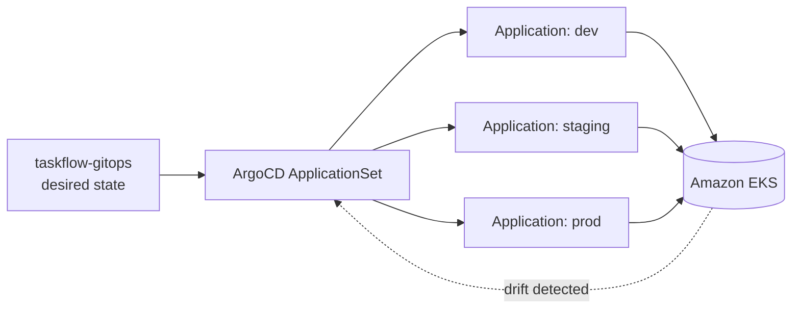

# Architecture

`taskflow-gitops` is the delivery layer for TaskFlow. It holds no application code and provisions no infrastructure — it declares desired state, and ArgoCD reconciles the cluster to it. This is pull-based delivery: the cluster pulls its config from Git rather than a pipeline pushing into the cluster.

## Components

- **ArgoCD ApplicationSet** — a single generator that templates one ArgoCD Application per environment from shared config.
- **Helm values, per environment** — dev, staging, and prod each carry their own values, rendered into their own Application.
- **ExternalDNS** — manages DNS records for exposed services automatically.
- **ACM** — provides TLS certificates for those services.

## Delivery flow

## Key decisions

**One ApplicationSet, many environments.** Rather than hand-maintaining a separate ArgoCD Application per environment, a single ApplicationSet templates all three. Adding or changing an environment is a config change in one place, not duplicated YAML.

**Git is the only source of truth.** Nothing is applied to the cluster by hand. Every change flows through this repo, which makes the cluster's state auditable and reproducible from Git history alone.

**Automated rollback on failed sync.** If a sync leaves an Application unhealthy, ArgoCD rolls back to the last good state rather than leaving the environment broken.

**Delivery is separated from build.** This repo never builds an image. It references images produced and gated by `taskflow-app`, keeping build concerns and delivery concerns cleanly split across repos.

## Deployment boundaries

| Concern | Decision |
|---------|----------|
| Role | Declarative desired state only |
| Delivery | ArgoCD ApplicationSet, pull-based |
| Environments | dev / staging / prod from one generator |
| Rollback | Automated on failed sync |
| Region | `us-east-1` |
| Account | `713923090919` |